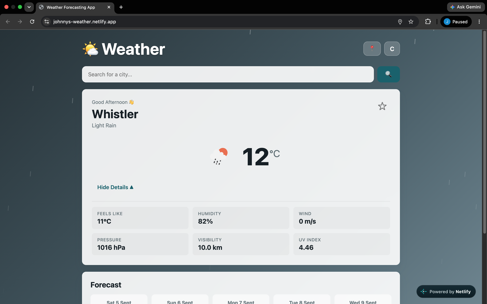
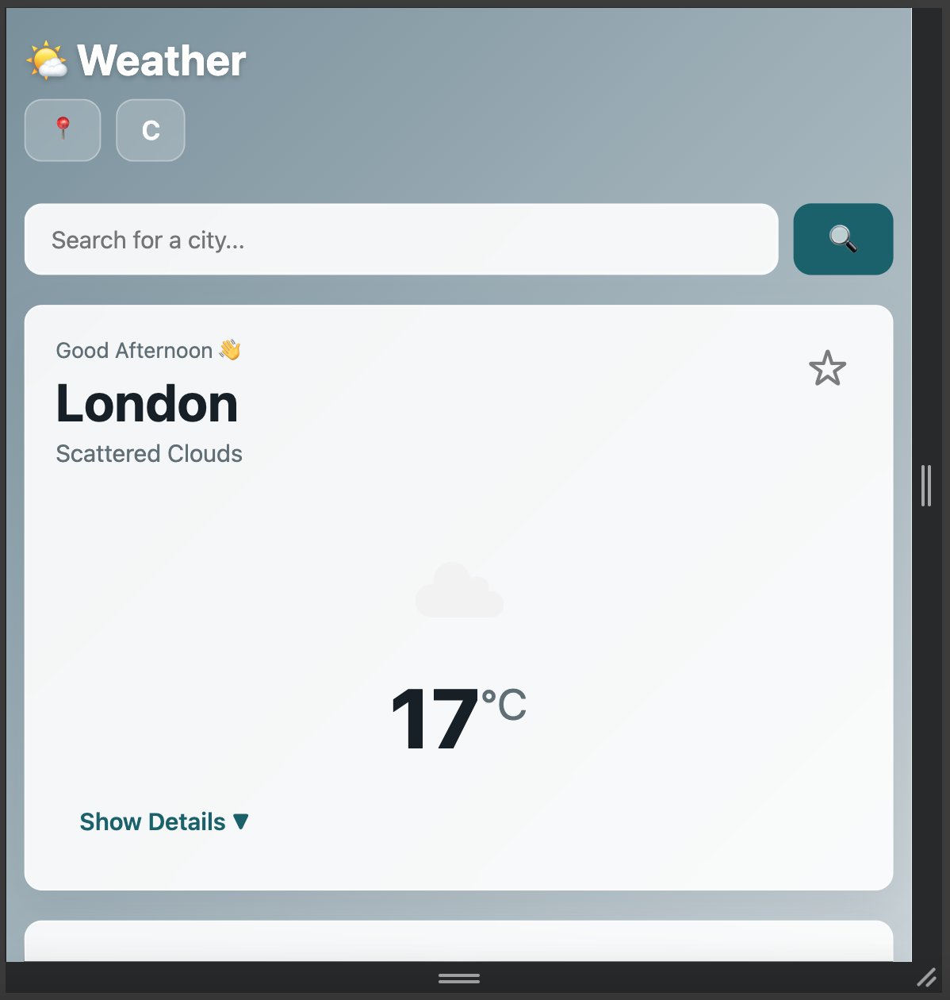
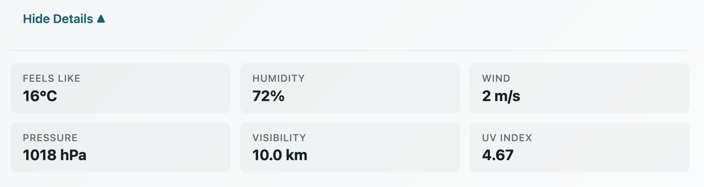
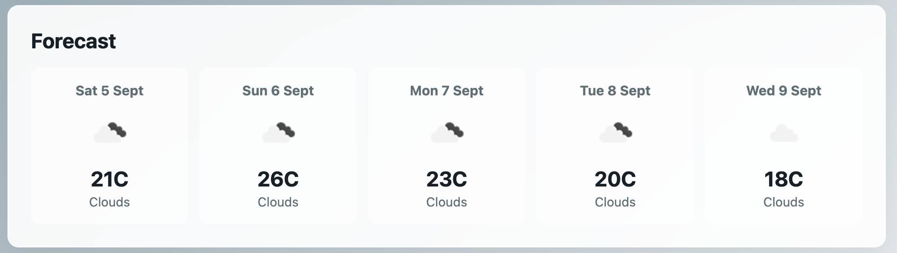

# 🌤️ Weather Forecasting App

A dynamic and visually appealing weather forecasting application built with **React** and the **OpenWeatherMap API**. Get real-time weather data, 5-day forecasts, and an immersive experience with weather-based animations.

### Core Features
- ✅ **Current Weather Display** - Temperature, feels-like, humidity, wind speed, pressure, visibility, and UV index
- ✅ **5-Day Forecast** - Daily weather predictions with icons and temperature trends
- ✅ **Unit Toggle** - Switch between Celsius (°C) and Fahrenheit (°F)
- ✅ **Location Detection** - Auto-detect your location using browser geolocation
- ✅ **Favorites** - Save and quickly access your favorite cities (persisted in localStorage)
- ✅ **Search** - Search for any city worldwide with debounced input

### UI/UX Features
- 🎨 **Dynamic Backgrounds** - Weather-adaptive backgrounds with color gradients
- 🌧️ **Weather Particles** - Rain and snow particle animations for immersive experience
- ✨ **Smooth Animations** - Framer Motion powered transitions and interactions
- 📱 **Responsive Design** - Fully responsive across all device sizes (mobile, tablet, desktop)
- ♿ **Accessibility** - ARIA labels, semantic HTML, keyboard navigation

### Technical Features
- 🔒 **Secure API Integration** - Environment variables for API key management
- 🛡️ **Error Handling** - User-friendly error messages for API failures, invalid inputs, and network issues
- 💾 **State Management** - Custom hooks with clean separation of concerns
- 📦 **Optimized Build** - Vite for fast development and production builds
- 🧪 **Error Boundary** - Graceful error handling with recovery options

## 📸 Screenshots

### Desktop View

### Mobile View

### Weather Details Expanded

### 5-Day Forecast

### Favorites Dropdown

## 🛠️ Tech Stack

| Technology | Purpose |
|------------|---------|
| **React 18** | UI Framework with hooks and functional components |
| **Vite** | Lightning-fast build tool and development server |
| **OpenWeatherMap API** | Weather data provider |
| **Framer Motion** | Smooth animations and transitions |
| **CSS3** | Custom styling with CSS variables, flexbox, and grid |
| **ESLint** | Code quality and consistency |
| **Git** | Version control |

## 📁 Project Structure
weather-app/
├── src/
│ ├── api/
│ │ └── weatherApi.js # API integration with error handling
│ ├── components/
│ │ ├── ErrorBoundary.jsx # React error boundary component
│ │ ├── Favorites.jsx # Favorites dropdown with animations
│ │ ├── ForecastList.jsx # 5-day forecast display
│ │ ├── SearchBar.jsx # Search with debounced input
│ │ ├── UnitToggle.jsx # Celsius/Fahrenheit toggle button
│ │ ├── WeatherBackground.jsx # Dynamic background with particles
│ │ └── WeatherDisplay.jsx # Current weather display with details
│ ├── hooks/
│ │ ├── useDebounce.js # Debounce custom hook
│ │ └── useWeather.js # Main weather logic and state management
│ ├── styles/
│ │ └── App.css # Global styles with CSS variables
│ ├── App.jsx # Main app component
│ └── main.jsx # Application entry point
├── .env # Environment variables (gitignored)
├── .gitignore # Git ignore file
├── index.html # HTML template
├── package.json # Dependencies and scripts
├── vite.config.js # Vite configuration
└── README.md # Project documentation